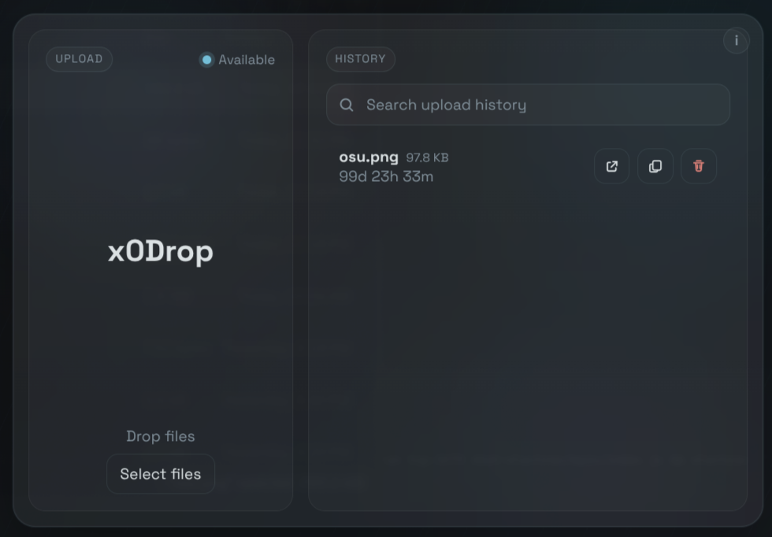

# <h1 align="center">x0Drop 📤</h1>

> 📤 x0Drop is a desktop client for `x0.at`, built with Electron, React, and Vite, focused on fast uploads, local history, and a cleaner desktop workflow.


> 💡 Sharing files with x0.at from the CLI is fast and awesome… but not everyone enjoys typing commands just to send a file.

<center></center>

---

## ✨ Features

- 📤 Drag & drop uploads with instant link copy  
- 🕓 Local history of all uploads  
- 📏 File size preview before sending  
- 🧠 Duplicate detection (SHA-256)  
- ⏳ Retention countdown based on x0.at rules  
- 🟢 Upload status indicator (online/offline)  
- 🔗 Quick access to links (open & remove)  

---

## 🌐 Availability States

- `Available`: upload route looks reachable  
- `Offline`: no network connection detected  
- `Blocked`: remote service appears rate-limited or access-restricted  
- `Unreachable`: remote service or proxy could not be reached  

---

## 🚀 Usage

To use this project, follow the steps below in your preferred terminal.

### 1️⃣ Installing Dependencies

Before anything else, install the necessary dependencies:

```shell
npm install
```

Note: This step is required before building or running the application.

### 2️⃣ Run in Development

You can start the application in development mode with:

```shell
npm run dev
```

### 3️⃣ Build Desktop Output

To build the application locally:

```shell
npm run build
```

### 4️⃣ Platform Packages

#### 🔹 Windows

Build the Windows package with:

```shell
npm run build-win
```

#### 🔹 macOS

Build the macOS package with:

```shell
npm run build-mac
```

#### 🔹 Linux

Build the Linux package with:

```shell
npm run build-lin
```

---

## 👤 Author

Give a ⭐️ if this project helped you!

---

## 📝 License

Copyright © 2026 [Macxzew](https://github.com/Macxzew).<br />
This project is licensed under the MIT License.
